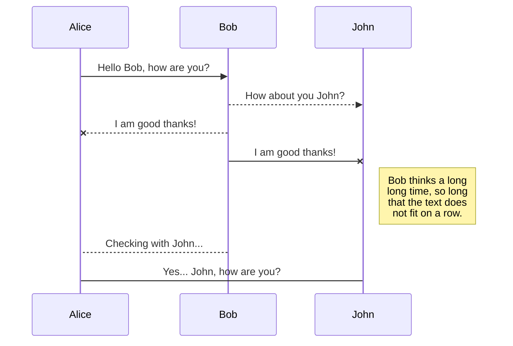
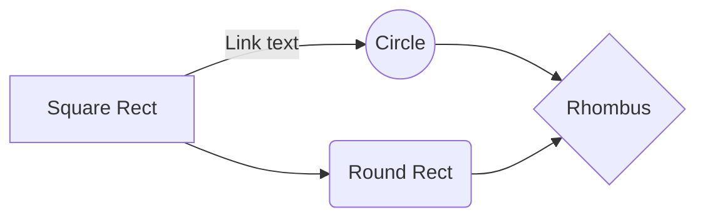

# Contents

- Spotify Recommender System

  * [Introduction](#introduction)
  
  * [Creating a Dataset of Spotify Songs](#creating-a-dataset-of-spotify-songs)
  
  * [Defining a Custom Recommender Algorithm](#defining-a-custom-recommender-algorithm)
  
  * [Writing the Algorithm](#writing-the-algorithm)
  
  * [Testing Some Recommendations](#testing-some-recommendations)
  
  * [Conclusion and Possible Improvements](#conclusion-and-possible-improvements)


## Introduction

In this post I'll be wrapping up my "series" on my Spotify recommender system and Python/C++ shared library. To conclude the project, I'm going to talk through the thinking behind the recommender system that I've built, as well as the results. While the goal of this phase of the project was to create a model that could be deployed and used in real time, I wasn't able to achieve this result with the dataset that I had retrieved using the API. However, I can say that I am happy with the results of the model themselves. More on that later.

## Creating a Dataset of Spotify Songs 

While datasets of Spotify tracks and audio features exist on sites such as [Kaggle]([https://www.kaggle.com/yamaerenay/spotify-dataset-19212020-160k-tracks](https://www.kaggle.com/yamaerenay/spotify-dataset-19212020-160k-tracks)), my motivation for building a Spotify API wrapper was to 'mine' Spotify data myself. In order to make the wrapper development process pay off, I aimed to build a dataset larger than the one available on Kaggle. 

To pull this off, I came up with a multi-phased approach to build out a set of tracks and their audio features. This would be a time consuming process, and in order to ensure that data would not be lost in case of a dropped internet connection (this happened. A LOT) or any other issues, I created a script to periodically create data checkpoints in S3. 

The approach to gathering the data looked like this:

* Use the following options from the ['Browse']([https://developer.spotify.com/documentation/web-api/reference/#category-browse](https://developer.spotify.com/documentation/web-api/reference/#category-browse)) API endpoint
	* All playlists from 'Categories'
	* All artists and albums from 'New Releases'
	* For dates ranging from 2013 - 2021, get all playlists from 'Featured Playlists'
* For the playlists collected above, iterate through each playlist's tracks and gather all albums, artists and tracks
* For all artists collected above, iterate through each artist and find all ['Related Artists']([https://developer.spotify.com/documentation/web-api/reference/#endpoint-get-an-artists-related-artists](https://developer.spotify.com/documentation/web-api/reference/#endpoint-get-an-artists-related-artists))
* After collecting artists and their 'related' artists, grab all albums created by those artists
* Grab all tracks from the albums that have been collected
* For each track, find its ['Audio Features']([https://developer.spotify.com/documentation/web-api/reference/#endpoint-get-audio-features](https://developer.spotify.com/documentation/web-api/reference/#endpoint-get-audio-features)) (this will serve as the basis for the content based filtering part of our recommender system)

After waiting for a couple of days (this could have gone on longer but I was tired of waiting), I built up a dataset of ~200k tracks, just beating out the dataset found on Kaggle. 

## Defining a Custom Recommender Algorithm 

[TLDR here](#algorithm-definition-tldr)

As mentioned in [my previous post]([https://alexilyin.me/2021/02/16/C++-Python-Project/](https://alexilyin.me/2021/02/16/C++-Python-Project/)), the two most widely accepted forms of recommender systems are

* Collaborative Filtering
* Content-Based Filtering

This section will discuss the 'Collaborative' filtering approach (with modifications) that I took. 

In order to attempt to improve on Spotify's current recommendations, I decided to build out an algorithm that would be a mix of Collaborative and Contest-Based filtering.


While Spotify does provide a feature to follow your friends, the Spotify _does not_ provide an API endpoint for accessing your followers. To mimic a network of friends and followers, I used the [Playlists]([https://developer.spotify.com/documentation/web-api/reference/#endpoint-get-a-list-of-current-users-playlists](https://developer.spotify.com/documentation/web-api/reference/#endpoint-get-a-list-of-current-users-playlists)) endpoint to get all of the current user's (my) playlists. From this list of playlists, I would keep only playlists that were not created by the current user, and grab the tracks from the remaining playlists. In this way, I would have a set of tracks that users that I follow listen to. This handles the 'collaborative' filtering aspect of my algorithm.

The next step is finding the audio features of each track in the remaining set, and comparing it with the audio features of the track the that user is currently listening to. In order to reduce compilation times and make sure that comparisons are only happening against relevant tracks, the set of tracks that remain is filtered for songs that have genres related to the genres of the current track. 


Initially, I thought that I would be able to complete a simple comparison of song genres by directly comparing them. However, upon examination of some Spotify genres, I realized that this would not work. It turns out that Spotify genres can be extremely specific:
```
[portland hip hop]
```

or can be specific with multiple values:

```
[hip hop, pop rap, rap, underground hip hop]
```

To create a workaround, I decided to incorporate the famous set distance metric **Jaccard Distance**.  However, with such specific values, applying Jaccard Distance directly to the genre sets would not provide accurate results. For example, for these two sets of genres:

```
[east coast hip hop, hip hop, pop rap, rap]
[chicago rap, conscious hip hop, hip hop]
```

The Jaccard Distance would be 0.16666666666666666. It is clear that these tracks are from similar genres, however, the computed Jaccard Distance tells us that these tracks are probably not from similar genres. An additional workaround that I implemented was taking the set union of each genre with sets of genres. For example:

```
[east coast hip hop, hip hop, pop rap, rap]
```
Would become:
```
{pop, coast, rap, hip, east, hop}
```

After taking the union of set of genres above, the new Jaccard Distance would be 0.5. This is closer to the answer we would expect. 

Back to our new dataset of tracks from our followed playlists: once we apply Jaccard Distance to the current track's genres and the rest of the tracks, we can filter out tracks that are not similar. Since the goal is to reduce compilation times while also keeping only tracks that are similar, I had to choose a similarity threshold for filtering the dataset. After trial and error, I decided to use the threshold 0.4 - I found that any value below 0.4 returned tracks/genres that were not as similar as needed. Additionally, when filtering for distance less than 0.4, the dataset reached a length at which compilation times would not be optimal (at this point I was still aiming to create a recommender algorithm that could be run in real time). 

After obtaining the final set of tracks, the next step would be to obtain the audio features for each song in the remaining set. This is where the dataset I collected in the previous set would come into play - if a song is already in our dataset, not additional computation is needed, as we can simply take the audio features we previously obtained. However, if the track is not in our ~200k track dataset, we will have to take the time to call the 'Audio Features' Spotify API endpoint to obtain audio features for that track.

#### Algorithm Definition TLDR

The set of steps mentioned above can be summarized as:

1. Start with the song the user is currently listening to
2. For this particular user, obtain a complete list of their playlists - playlists they created and playlists they follow
3. For the set of playlists that they follow, create a set of tracks contained in those playlists
4. For each track in the playlist, take the Jaccard Distance between the genres of the current track, and each track's genres in the set above
5. Filter the above set to tracks having Jaccard Distance >= 0.4
6. Find the audio features of the remaining tracks


Now that we have a 'final' set of similar tracks, we are left with finding a way to obtain the similarity of each track to the track the user is currently listening to. Among popular similarity metrics for recommender systems, Cosine Similarity is one that stood out - this metric will return the cosine of the angles between two vectors, both of which have been normalized to have lengths of 1. Using this metric, two parallel lines will have Cosine Similarity of 0. However, as the distance between two lines decreases, so does their cosine value/Cosine Similarity. 

Here is an example of a set of audio features for a particular track: 
```
""0.468","0.462","7","-17.189","1","0.0262","0.0199","4.48E-6","0.584","0.588","95.99","318000","4"
```

In such a case, we can assume that Jaccard Distance or other similarity metrics would not provide us an optimal measure of similarity.

## Writing the Algorithm

This section will cover the 'Content-based' filtering section of my algorithm. I'll be walking through the Python code chunks I wrote (some parts of the algorithm were covered in the previous section). 

Here are the three functions used to produce a set of recommended songs.

```python
# List Union Function - For a list of lists, return the union of all the lists 
def list_union(set_list: list)->set:
	start = set(set_list[0])
	for others in set_list[1:]:
		start = start.union(others)
	return start


def get_song_artist_df(followed_playlists):
	# Take the playlists that a user follows. For each playlist in that list, create a dictionary having keys set to each unique track ID, with values set to
	# the artists that are featured on that track.

	followed_tracks_artists = {}

	for playlist_id in followed_playlists:

		try:
			res = cpp.get_playlists(False, '', playlist_id, 'tracks')
			for track in res['items']:
				if track['track']['id'] not  in followed_tracks_artists.keys():
					followed_tracks_artists[track['track']['id']] = [art['id'] for art in track['track']['artists']]
				else:
					for artist in track['track']['artists']:
						followed_tracks_artists[track['track']['id']].append(artist['id'])
						
		# Skip tracks that produce an error 
		except  Exception  as e:
			print(e)
			pass

	# Create a DataFrame containing with each row containing a unique artist-track combinations

	followed_tracks_df = pd.DataFrame(columns=['track', 'artist'])

	  

	for track in followed_tracks_artists.keys():
		for row in followed_tracks_artists[track]:
			followed_tracks_df = followed_tracks_df.append({'track': track, 'artist': row}, ignore_index=True)

	# Now that we have a DataFrame of unique artist-track combinations, we want to find the genres for each unique artist. Spotify does not release track genre information  
	# through its API, for this reason we have to find the genre of the artist. We will use this genre information to filter the final DataFrame to match genres with the song/artist
	# that is currently being listened to

	 
	artist_genre = {}
	for artist_id in followed_tracks_df['artist'].unique():
		if artist_id not in artist_genre.keys():
			artist_genre[artist_id] = cpp.get_artists(artist_id)['genres'] if cpp.get_artists(artist_id)['genres'] != [] and  'genres'  in cpp.get_artists(artist_id).keys() else  None

	# For the newly created artist_genre dictionary above, match each artist ID in our previously created DataFrame with its genre in the dictionary. Use this to create a new 'genre'
	# column in the DataFrame. Filter out any artists that do not have genre information

	followed_tracks_df['genres'] = [artist_genre[id] for  id  in followed_tracks_df['artist']]
	followed_tracks_df = followed_tracks_df[followed_tracks_df['genres'].notna()]

	# For the newly created 'genre' column, split the genres into words and create a union of those words for each artist. The reason we do this is that Spotify contains a lot of unique
	# genres. Since we have a rather small dataset, we want to split more rare genres such as 'german hip hop' into a set ('german', 'hip', 'hop') so that this song will match with other
	# german or hip-hop tracks

	followed_tracks_df['genre_words'] = [list_union([word for word in [genre_string.split(' ') for genre_string in genre_list]]) for genre_list in followed_tracks_df['genres'].values]

	return followed_tracks_df


def current_song_info(song_id)->tuple:
	# For the current song, get the song's artists and the genres for those artists
	
	track_info = cpp.get_tracks(song_id)
	current_artists = [artist['id'] for artist in track_info['artists']]
	
	current_genres = {}
	for artist in current_artists:
		try:
			current_genres[artist] = cpp.get_artists(artist)['genres']
		except  Exception  as e:
			current_genres[artist] =  None
	return current_genres

def  get_audio_features(tracks, existing_data):
	# Create a dictionary of tracks and their audio features. If the song exists in the current dataset, retrieve that information. If it doesn't, retrieve the information from the
	# Spotify API

	audio_features = {}
	for id in tracks:
		if id in existing_data['track_id'].values:
			audio_features[id] = existing_data[existing_data['track_id']==id].iloc[:, np.r_[5:16, 21:23]].values.tolist()
	else:
		try:
			audio_features[id] =  list({k:v for k,v in cpp.get_tracks(id, 'audio-features').items() if k in existing_data.columns[np.r_[5:16, 21:23]].values}.values())
		except:
			pass

	return audio_features


def song_rec(user_id, get_playlists_results, current_song, stored_songs):
	# Given a user_id, find all playlists that the user follows. Using this logic, we can create a set of tracks listened to by users that created these followed playlists.
	# Since the Spotify API does not let us find followed users, this is our best bet for collaborative filtering

	followed_playlists = [playlist['id'] for playlist in json.loads(get_playlists_results)['items'] if playlist['owner']['id'] != user_id]

	# Call the two functions above to get information for tracks contained in 'followed playlists', as well as track information for the current song	  

	followed_tracks_df = get_song_artist_df(followed_playlists)

	current_genres = current_song_info(current_song)

	# For the genres of the current song/artist(s), create a union of genre words

	current_genres_words = list_union([word for word in [dict_values.split(' ') for all_genres in current_genres.values() for dict_values in all_genres]])

	# Find the set Jaccard distance between the genres of the current song/artist(s) and all the songs in our followed tracks dataset. Since Spotify has unique genre naming conventions,
	# it will be harder to find exact matches for sets of genres

	followed_tracks_df['jac_dist'] = [round(jaccard_similarity(np.array(current_genres_words), np.array(followed_genre)), 2) for followed_genre in followed_tracks_df['genre_words']]

	# Keep songs which genre sets have Jaccard distance greater than or equal to 0.4

	followed_tracks_df = followed_tracks_df[followed_tracks_df['jac_dist'] >=  0.4]

	# Get the audio features for the songs in the remaining dataset

	followed_tracks_audio_features = get_audio_features(followed_tracks_df['track'].unique(), stored_songs)

	# Set the audio_features retrieved above as a new column in the dataframe

	followed_tracks_df['audio_features'] = [followed_tracks_audio_features[track] if track in followed_tracks_audio_features else  None  for track in followed_tracks_df['track']]

	followed_tracks_df = followed_tracks_df[followed_tracks_df['audio_features'].notna()]

	# Get the audio_features of the current song. We will be calculating the cosine similarity of the audio features of the current song to each song in our dataframe. Keep only the audio feature values from the total set of returned columns

	af_list_values =  list({k:v for k,v in cpp.get_tracks(current_song, 'audio-features').items() if k in stored_songs.columns[np.r_[5:16, 21:23]].values}.values())

	# Now that we have the audio features of the current song and the songs with closely matching genres, we can calculate cosine similarity. Sort the
	# DataFrame by cosine similarity and Jaccard distance. Then return the DataFrame

	followed_tracks_df['cosine_sim'] = [cosine_similarity(np.array(af_list_values), stored_songs.iloc[x, np.r_[5:16, 21:23]].values) for x in  range(len(followed_tracks_df))]
	followed_tracks_df.sort_values(['jac_dist', 'cosine_sim'], ascending=False)

	return followed_tracks_df
```

Now that we've defined our functions, lets test some output to see if it matches our expected results.

## Testing Some Recommendations

To test the results of the algorithm, I'll pick two random tracks from ~200k track dataset

### Song 1  - 

## SmartyPants

SmartyPants converts ASCII punctuation characters into "smart" typographic punctuation HTML entities. For example:

|                |ASCII                          |HTML                         |
|----------------|-------------------------------|-----------------------------|
|Single backticks|`'Isn't this fun?'`            |'Isn't this fun?'            |
|Quotes          |`"Isn't this fun?"`            |"Isn't this fun?"            |
|Dashes          |`-- is en-dash, --- is em-dash`|-- is en-dash, --- is em-dash|


## KaTeX

You can render LaTeX mathematical expressions using [KaTeX](https://khan.github.io/KaTeX/):

The *Gamma function* satisfying $\Gamma(n) = (n-1)!\quad\forall n\in\mathbb N$ is via the Euler integral

$$
\Gamma(z) = \int_0^\infty t^{z-1}e^{-t}dt\,.
$$

> You can find more information about **LaTeX** mathematical expressions [here](http://meta.math.stackexchange.com/questions/5020/mathjax-basic-tutorial-and-quick-reference).


## UML diagrams

You can render UML diagrams using [Mermaid](https://mermaidjs.github.io/). For example, this will produce a sequence diagram:



And this will produce a flow chart:


